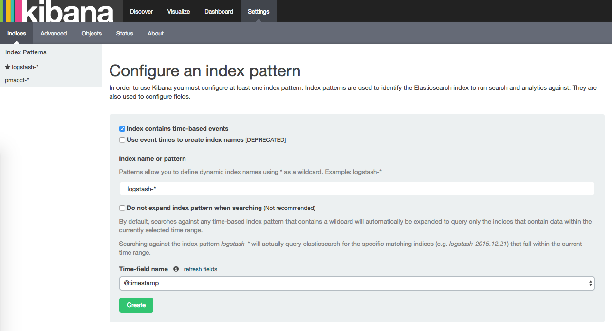

# CISE-ELK

## Overview

This repository contains all the logstash and pmacctd configs, elasticsearch index templates, and kibana dashboards created for the CISE project. It represents an entire configured ELK stack which can be used to record and report on security relevant events for your infrastructure.

Also included are configurations for docker and docker-compose, to allow an entire running stack to be bought up quickly for testing.

It is not intended that you should run an ELK cluster with the settings from this docker-compose environment - in a production setting you should configure a cluster for your own security, availability and performance requirements.

However, the logstash and pmacctd configurations are relevant for all installations.

## Project Structure

The `sources` directory contains subdirectories for the data sources we collect: `syslog`, `dns` and `sflow`. Each source includes logstash configs named `index.conf`, `filter.conf` and `output.conf` and optionally a `patterns` directory containing logstash grok patterns.

Also included for each source is `index-template.json`, an index template for elasticsearch that contains the type mappings for the source, and `kibana-dashboards.json` with all the kibana searches, visualisations and dashboards for the source.

The `collectors` directory contains configurations on how to configure collection agents to send data to the CISE-ELK stack.

The `elasticsearch`, `logstash` and `pmacct` directories contain `Dockerfile`s and configurations for the docker-compose environment.

## Start stack with docker-compose

Before you can start up the stack, you need to [install docker](https://docs.docker.com/engine/installation/) and [install docker-compose](https://docs.docker.com/compose/install/)

Clone this repository, then bring up CISE-ELK by running from the root directory of project:

    docker-compose up -d && docker-compose logs -f

This will download and build all the required docker containers, then start them in the correct order. Afterwards you'll have the following services running:

- Elasticsearch
- Logstash
- Kibana
- pmacctd
- RabbitMQ (for pmacctd)
- Redis (for logstash sflow filters)

## Sending data

You need to configure your infrastructure to send data to the CISE-ELK stack

### Syslog

Devices that support syslog should be configured to send data to the IP address or hostname of your stack on port 9991, using either TCP or UDP.

If you already have a centralised syslog server, it may be convenient to configure that server for forward all logs it receives to the CISE-ELK stack.

### DNS

DNS collection is performed by packetbeat, an elasic product. It is a real time network packet analyser. See [Data Collection Configs](collection/README.md) for more information.

Packetbeat should be configured to send data to the IP address or hostname of your stack on port 9997.

### Sflow / Netflow

Devices that support sflow should be configured to send sflow data to the IP address or hostname of your stack on port 23501.

Devices that support netflow should be configured to send sflow data to the IP address or hostname of your stack on port 23502.

### Table of Listening Ports

Source | Port | Protocol
-------|------|---------
Syslog | 9991 | TCP or UDP
sflow  | 23501 | UDP
netflow  | 23502 | UDP
DNS    | 9997 | TCP

## Management Interfaces

Once the CISE-ELK stack has started, the following management tools are available to use (replace localhost with your IP address or hostname)

Tool|URL|Notes
----|---|-----
Elasticsearch kopf admin | http://localhost:9200/_plugin/kopf/#!/cluster |
RabbitMQ web admin | http://localhost:15672/ | user: guest, password: guest
Kibana | http://localhost:5601

## Adding indices to kibana

Once you have sent data to logstash for a new source, you'll need to add the index pattern to Kibana to view the data.

The following sources and index patterns can be added:

Source | Index Pattern
-------|--------------
Syslog | `logstash-*`
Sflow  | `pmacct-*`
DNS    | `packetbeat-*`

Navigate to Kibana on `http://localhost:5601` and select the Settings tab, followed by the Indices sub-tab. (replace localhost with your IP address or hostname)

Type in the name of the index pattern (see list above) and then use the drop down to select `@timestamp` as the Time-field name. Finally click on the `Create` button to add the index.

Click on the Discover tab, you should now see the index pattern in the drop down in the top left.

## Adding dashboards to Kibana

Once data is being sent to the CISE-ELK stack, and the indices have been added to Kibana, the data can be explored using the supplied searches, visualisations and dashboards.

Navigate to Kibana on `http://localhost:5601` and select the Settings tab, followed by the Objects sub-tab. (replace localhost with your IP address or hostname)

From the `Edit Saved Objects` screen, click `Import` and select from your local filesystem the relevant `kibana-dashboards.json` for each data source you're using.

## Generating sample data

It may be helpful to generate some data types for testing. Some examples are listed here.

### sflow

    docker-compose exec pmacct /opt/pmacct/sbin/pmacctd -f /opt/pmacct/sflow_agent.conf

